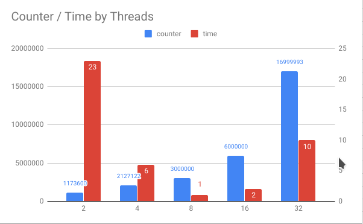
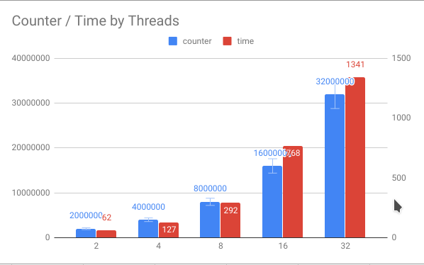

# Jie Tao - G01723372
### Outputs:
Unsynchronized:

Counter is much smaller than n\*1000000, since my hardware is 8 threads CPU, the time costing is decreasing exponentially from 2-8 threads. However, when the threads are over 8 threads, the time is increasing again.

Synchronized:

Counter is equal to n\*1000000, since my hardware is 8 threads CPU, the time costing is increasing almost linearly from 2-8 threads. After 8 threads, the unit time costing for each threads is a little longer than previous.

### Analysis:

**1. Is the counter always equal to n * 1000000, where n is the number of threads created?  Explain why, or why not.**

NO. Program A is without thread synchronization. Each thread can access `counter` object at a time, which makes counter less than n * 1000000. 

**2. Is the counter always equal to n * 1000000, where n is the number of threads created?  Explain why, or why not.**

Yes. Since Program B is thread synchronized. It only has one thread executing inside `counter` at a time. All other threads attempting to enter the synchronized block are blocked until the thread inside exits the block.

**3. Analyze the differences in elapsed time between Program A and Program B.  Is there a significant difference?  Explain why or why not.**

Program B is significantly slower than Program A. Since threads in program B are synchronized, they can’t access `counter` until the thread inside exits, this waiting process takes time. Meanwhile, the threads in program A, can access `counter` anytime.  Also the time costing is related to the hardware, in the unsynchronized program, if created threads less or equal than hardware, it will significant reduce time costing; in the synchronized program, since `Counter` object is exculded obtained, the time costing is increasing almost linearly.
